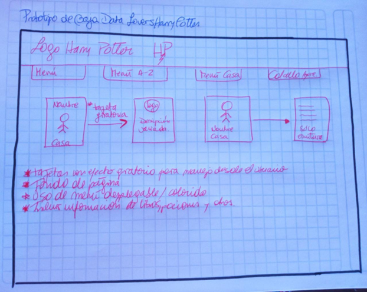
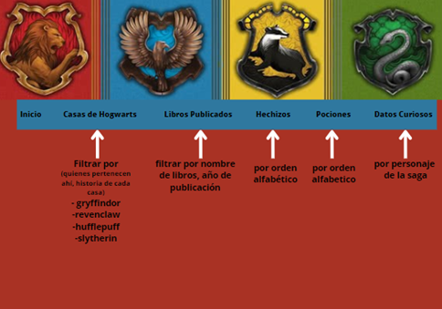
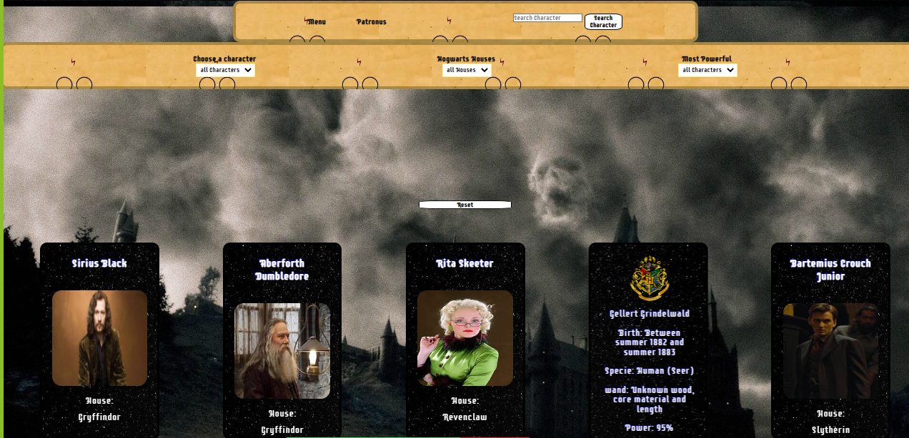

# Data Lovers Harry Potter

## Índice

* [1. Preámbulo](#1-preámbulo)
* [2. Resumen del proyecto](#2-resumen-del-proyecto)
* [3. Definición del Producto](#3-definicion-del-producto)
* [4. A quién va dirigido](#4-a-quien-va-dirigido)
* [4.1 Historias de usuario](#4-historias-de-usuario)
* [5. Prototipos](#5-prototipos)
* [6. Checklist para finalizar el proyecto Data Lovers](#5-checklist-para-finalizar-el-proyecto-Data-Lovers)

***
## 1. Preámbulo

El siguiente proyecto de desarrollo web, contempla el aprender y usar herramientas variadas en relación al uso de funciones, parametros, objetos y el procesamiento de datos en la creación de interfaces y visualizaciones. 

El siguiente repositorio contempla códigos y fundamentos de HTML, CSS y JavaScript. 

## 2. Resumen del proyecto

Este segundo proyecto de trabajo fue realizado por Leidy Suarez y Tiare Rojas para la generación DEV004 del bootcamp de Desarrollo Web.
Como dupla de trabajo decidimos trabajar con la data de Harry Potter, ya que forma parte de un mundo mágico reconocido por todos. Es por eso que nuestra página web está enfocada en información para fanáticos y no tan fanáticos de la serie de libros y películas del Mago Harry Potter y sus aventuras. 

Este proyecto estuvo dividido en cuatro sprints en los cuales se:
-construyó una página web para visualizar un conjunto o set de datos los cuales serán adecuados a lo que el usuario necesita. 
- filtre, ordene y contemple un cálculo agregado. 
- use data entregrada de antemano.

* [Harry Potter](src/data/harrypotter/harry.json).
  En este set encontrarás una lista de los personajes,libros pociones
  y hechizos de toda la saga de
  [Harry Potter](https://harrypotter.fandom.com).
  - [Investigación con seguidoras de Harry Potter](src/data/harrypotter/README.md)

## 3. Definición del producto 

La interfaz creada fue realizada con la data dada de antemano, la cual fue editada de acuerdo a las necesidades de nuestras Historias de Usuario para tener la información lo más completa posible. En esta interfaz encontrarás como usuario información acerca de 50 personajes de la saga de Harry Potter, la casa de Hogwarts a la que pertenecen, podrás visualizar imágenes, ordenar de forma alfabetica y por género la data entregada. 

Basamos nuestro trabajo en las historias de usuario recolectadas, las cuales fueron utilizadas para guiar nuestras semanas de trabajo.

## 4. A quién va dirigido. 

Estas historias de usuario representan el resultado de tu proceso de investigación de los posibles usuarios de la interfaz. Para identificarlos respondimos las siguientes preguntas como creadoras. 

¿Quién es el usuario? 
Fanáticos y no tan fanáticos de la serie de libros y películas del Mago Harry Potter y sus aventuras. Personas que quieran conocer más del mundo, de los personajes y sus descripciones o todo lo relacionado al mundo mágico creado por J.K. Rowling. 

¿Qué necesita saber?
En esta interfaz encontrarás información acerca de los personajes y las casa a la que pertenecen cada uno de ellos. 

¿Qué necesita ver?
Se podrá visualizar imágenes, interactuar con filtros en una página responsive.  

¿Cuáles son los datos?
Los datos a utilizar son name, house, patronus, gender y power de cada uno de 50 personajes seleccionados dentro de la data. 

¿Cuándo utilizarían el producto?
Lo usarían cuando tengan dudas acerca de los personajes más y menos poderosos de la saga y también para conocer la casa a la que pertenecen cada una de los magos.

## 4.1 Historias de Usuario

Nuestras historias de usuario fueron 4 las cuales incluyen los criterios de aceptación de cada una de ellas. 

Historia 1 
COMO: Fan Harry Potter.
QUIERO: Visualizar a todos los personajes de Harry Potter  
PARA: Saber qué personajes hay en Hogwarts
CRITERIO DE ACEPTACIÓN: 
•	La página debe mostrar cada uno de los personajes con sus nombres, casa a la que pertenece, año de nacimiento y otra información relevante. 
•	Debe pasar Test unitario.
•	Debe ser responsive.

Historia 2
COMO: Fan de Harry Potter
QUIERO: Poder ordenar todos los personajes en orden alfabético, así como de manera ascendente y descendente.
PARA: poder tener un orden específico a la hora de la búsqueda.
CRITERIOS DE ACEPTACIÓN
•	La página debe permitir ordenar de A-Z y de Z-A.
•	El usuario debe poder seleccionar el orden que desee obtener.
•	Debe pasar Test unitario.
•	Debe ser responsive.

Historia 3
COMO: Fan de Harry Potter.
QUIERO: Filtrar los personajes según la casa de Hogwarts a la que pertenezca (Gryffindor, Slytherin, Ravenclaw, Hufflepuff)
PARA: Poder agrupar los personajes según su casa.
CRITERIOS DE ACEPTACIÓN
•	La página debe permitir filtrar según la casa a la que pertenezca.
•	El usuario debe poder seleccionar el tipo de casa de Hogwarts
•	Debe pasar Test unitario.
•	Debe ser responsive.

Historia 4
COMO: Fan de Harry Potter.
QUIERO: conocer los personajes que son más poderosos en la saga de Harry Potter
PARA: Poder calcular qué personajes tienen más poder.
CRITERIOS DE ACEPTACIÓN
•	La página debe calcular los personajes de forma descendente de acuerdo al poder que tienen cada uno, separados por Witches y Wizards, incluyendo un texto dinamico que vaya mostrando el cálculo. 
•	Debe pasar Test unitario.
•	Debe ser responsive.

## 5. Prototipos

1.- Prototipo de baja fidelidad:

Este corresponde al boceto e idea inicial de como debía verse nuestra interfaz. Fue realizado a papel y lápiz.
(Prototipo1)

##### Fuente

2.- Prototipo de alta fidelidad:

Este corresponde a un prototipo realizado en canva, como diseño inicial era como deseabamos implementar nuestra página web. 
(Prototipo2)

##### Fuente

3.- Página diseño final:

Finalmente, con muchos cambios realizados se hicieron cambios en el diseño, los colores y como deseabamos que funcionara nuestra página web. 
(Prototipofinal)

##### Fuente

## 6. Checklist para finalizar el proyecto Data Lovers

* [ ] Usa VanillaJS.
* [ ] Pasa linter (`npm run pretest`)
* [ ] Pasa tests (`npm test`)
* [ ] Pruebas unitarias cubren un mínimo del 70% de statements, functions y
  lines y branches.
* [ ] Incluye _Definición del producto_ clara e informativa en `README.md`.
* [ ] Incluye historias de usuario en `README.md`.
* [ ] Incluye _sketch_ de la solución (prototipo de baja fidelidad) en
  `README.md`.
* [ ] Incluye _Diseño de la Interfaz de Usuario_ (prototipo de alta fidelidad)
  en `README.md`.
* [ ] Incluye el listado de problemas que detectaste a través de tests de
  usabilidad en el `README.md`.
* [ ] UI: Muestra lista y/o tabla con datos y/o indicadores.
* [ ] UI: Permite ordenar data por uno o más campos (asc y desc).
* [ ] UI: Permite filtrar data en base a una condición.
* [ ] UI: Es _responsive_.

*Disclaimer: Como fans de la saga de Harry Potter condenamos y no compartimos, los dichos y pensamientos de la autora J.K. Rowling respecto a la identidad de género, a las personas neurodivergentes, personas migrantes u otros. 